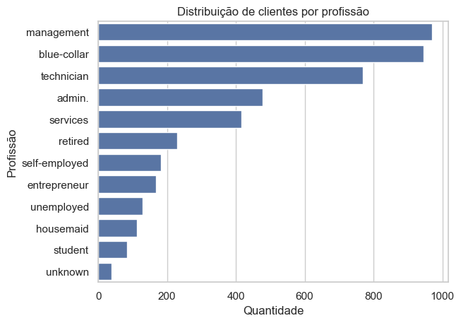
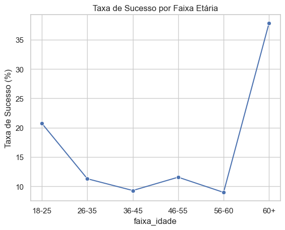

# Análise de Campanha de Marketing Bancário



Este projeto analisa dados de uma campanha de marketing de um banco, com o objetivo de identificar padrões e gerar insights que ajudem a aumentar a taxa de conversão de clientes.

O trabalho foi desenvolvido utilizando Python e SQL integrados, com visualizações para facilitar a interpretação dos resultados.

---

## Objetivos

- Explorar e compreender o perfil dos clientes do banco.
- Analisar fatores que influenciam a aceitação do produto ofertado.
- Demonstrar habilidades práticas em Python, SQL e Análise de Dados.

---

## Tecnologias Utilizadas

- Python: Pandas, Matplotlib, Seaborn
- SQL: Consultas diretas em banco SQLite
- Jupyter Notebook para organização e execução do projeto

---

## Estrutura do Projeto

- `analise_campanha.ipynb` → Notebook com todo o código, consultas SQL e gráficos.
- `bank_marketing.db` → Banco de dados gerado a partir do dataset original.
- `README.md` → Documentação do projeto.
- `imagens/` → Pasta com gráficos gerados pelo notebook.

---

## Principais Análises

1. Distribuição por profissão  
   Identificação de quais profissões têm mais clientes no banco.

2. Saldo médio por estado civil  
   Comparação do saldo médio entre solteiros, casados e divorciados.

3. Taxa de sucesso por profissão  
   Profissões com maior percentual de conversão na campanha.

4. Taxa de sucesso por faixa etária  
   Idades mais propensas a aceitar o produto.

---

## Principais Insights

- Profissões como aposentados e estudantes apresentaram taxas de conversão acima da média — indicando oportunidade para campanhas mais direcionadas.
- Clientes entre 26 e 35 anos tiveram desempenho melhor que outras faixas etárias — sugerindo foco nesse público para otimização de resultados.
- Estado civil "solteiro" tende a ter maior saldo médio no banco, o que pode indicar maior poder de investimento.

Essas descobertas podem orientar estratégias de marketing mais eficazes, reduzindo custo e aumentando conversões.

---

## Exemplos de Gráficos

  


---

## Como Executar

1. Clonar o repositório
   ```bash
   git clone https://github.com/Lincoln-M-Oliveira/analise-banco.git
   cd analise-banco
   
2. Instalar dependências
   ```
   pip install pandas matplotlib seaborn
   
3. Abrir o notebook
